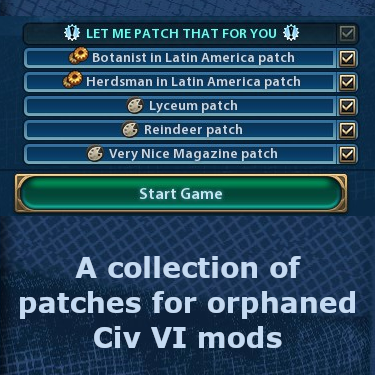

# Let Me Patch That For You
> A collection of patches for orphaned Civ VI mods.




## About this Mod
Civilization VI modding community is a very vibrant and productive one. There are thousands of mods out there. More than 5500 can be found in the Steam Workshop. Some mods are just small tweaks and additons, other mods are incredibly complex. And so many mods out there are doing a really great job in making the game a little bit better and more fun to play, no matter how big and complex they are.
But unfortunately not all of the modders are still supporting or working on their mod. No accusation, no complaining! Time is a precious commodity and sometimes it's just the priorities that change.
Anyway, and for what reasons ever, there are a few mods out there that haven't been updated in a while and error reports or improvement request in the comments haven't been answered either. These mods seem to be "orphaned".
The "Let Me Patch That For You" mod wants to help and breathe new life into these "orphans" by applying little patches to them to fix errors, add some improvements or establish compatibility to other mods.
There are three classes of patches:
1. cosmetic patches
1. compatibility patches
1. improvement patches
The **cosmetic patches**  are typically small patches that try to fix little errors or forgotten trifles and do not have any effect on the gameplay. These include forgotten text updates, forgotten translation options or errors in the sql or xml files that lead to information not being displayed in the game etc.
The **compatibility patches** try to make two mods work together ingame. A typical example is a unit that can interact with elements introduced by another mod, such as a new resource. Usually, these patches have a minor impact on the gameplay.
The **improvement patches** try to improve a mod by adding new features to it. These patches have a more or less large, but noticeable impact on the gameplay.

## Installation

### Steam Workshop
The easiest way to install the latest release of this mod is to enable it in the Steam Workshop: https://steamcommunity.com/sharedfiles/filedetails/?id=comingsoon .

### Manual installation
You can also download the repository here as a zip file and copy the included "LetMePatchThatForYou" folder to your local Civ VI mod folder:

```
Windows : Documents\My Games\Sid Meier's Civilization VI\Mods
Mac : /Users/[user]/Library/Application Support/Sid Meier's Civilization VI/Mods
Linux : ~/.local/share/aspyr-media/Sid Meier's Civilization VI/Mods
```

## Further plans
There are more orphaned mods out there that might be worth it to be patched and integrated in this mod.
Suggestions always welcome.

## Acknowledgments

Special thanks to all Civ VI modders, especially those whose mods have been patched here over time.
