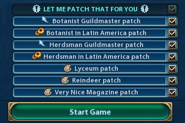

# Let Me Patch That For You - Docs

##Included patches
So far the following patches have been added to this mod:
- [b]Botanist Guildmaster patch[/b] (improvement)\This patch adds the botanist to Governor Liang's "Guildmaster" promotion.
- [b]Botanist in Latin America patch[/b] (compatibility)\This patch lets the botanist use the resources from the "Latin American Resources" mod.
- [b]Herdsman in Latin America patch[/b] (compatibility)\This patch lets the herdsman use the resources from the "Latin American Resources" mod.
- [b]Lyceum patch[/b] (cosmetic)\A small patch to fix/add the Lyceum''s name and description to this building.
- [b]Reindeer patch[/b] (cosmetic)\A small patch to add the reindeer to the description of "Animal husbandry".
- [b]Very Nice Magazine patch[/b] (cosmetic)\A small patch to fix/add the Magazine's name and description to this building.

Detailed docs about the patches and how to use them will follow soon (hopefully)....
