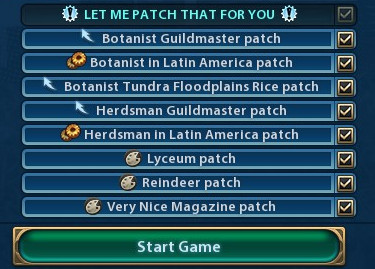

# Let Me Patch That For You - Docs

## Included patches
So far the following patches have been added to this mod:

- **Botanist Guildmaster patch** (improvement) This patch adds the botanist to Governor Liang's "Guildmaster" promotion.
- **Botanist in Latin America patch** (compatibility) This patch lets the botanist use the resources from the "Latin American Resources" mod.
- **Botanist Tundra Floodplains Rice patch** (compatibility) This patch enables the botanist to plant rice on tundra floodplains fields introduced by the "Wetlands" mod.
- **Herdsman Guildmaster patch** (improvement) This patch adds the herdsman to Governor Liang's "Guildmaster" promotion.
- **Herdsman in Latin America patch** (compatibility) This patch lets the herdsman use the resources from the "Latin American Resources" mod.
- **Lyceum patch** (cosmetic) A small patch to fix/add the Lyceum''s name and description to this building.
- **Reindeer patch** (cosmetic) A small patch to add the reindeer to the description of "Animal husbandry".
- **Very Nice Magazine patch** (cosmetic) A small patch to fix/add the Magazine's name and description to this building.

Detailed docs about the patches and how to use them will follow soon (hopefully)....
